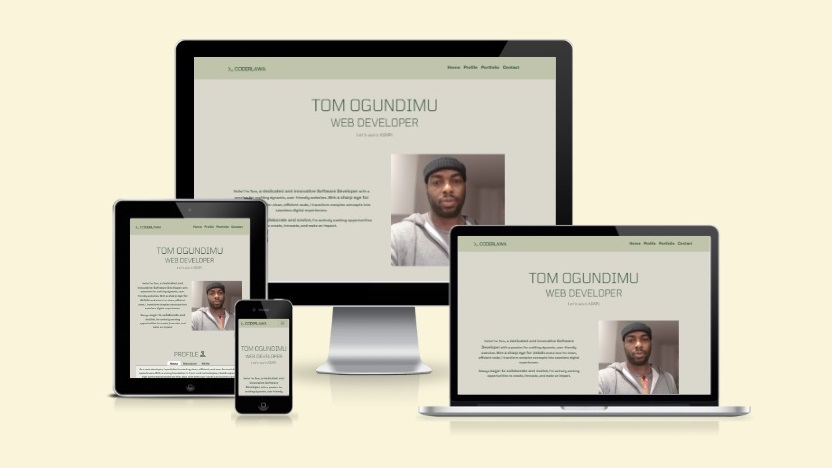

# CODERLAWA - Web Dev Portfolio

This website has been built to accomodate most visitors needs, regardless of the device used to access it - this means it is robustly responsive.

[View CODERLAWA on Github](https://coderlawa.github.io/milestoneOne/)

## TABLE OF CONTENT

* [User Experience (UX)](#User-Experience-(UX))
    * [Initial Discussion](#Initial-Discussion)
    * [User Stories](#User-Stories)

- - -

## User Experience (UX)

### Initial Discussion