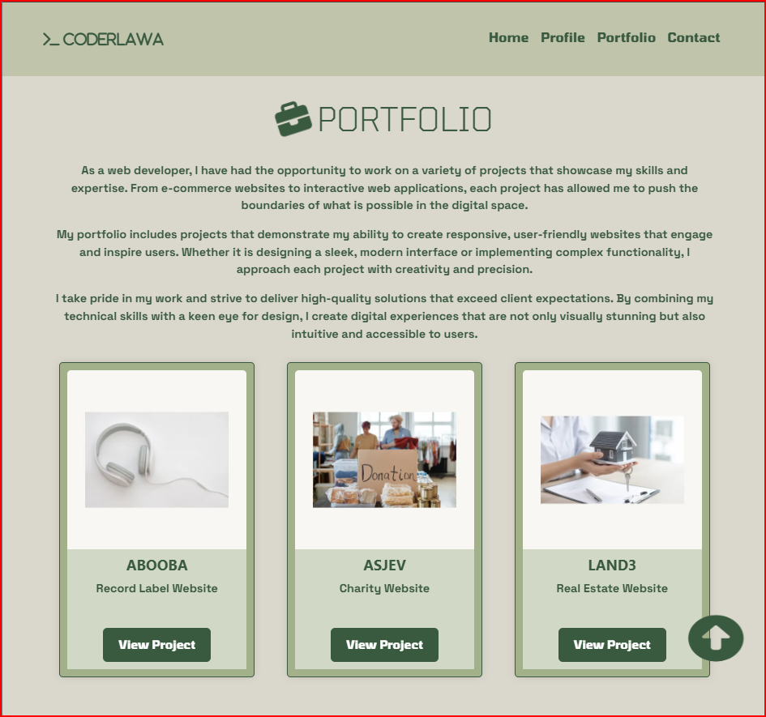

# CODERLAWA - Web Dev Portfolio

This website has been built to accomodate most visitors needs, regardless of the device used to access it - this means it is robustly responsive.

[View CODERLAWA on Github](https://coderlawa.github.io/milestoneOne/)

## TABLE OF CONTENT

* [User Experience (UX)](#user-experience-ux)
    * [Initial Discussion](#initial-discussion)
    * [User Stories](#user-stories)

* [Design](#design)
    * [Color Scheme](#color-scheme)
    * [Typography](#typography)
    * [Imagery](#imagery)
    * [Wireframes](#wireframes)
        * [Home Page](#home-page)
        * [Profile](#profile)
        * [Portfolio](#portfolio)
        * [Contact Us](#contact)
    * [Features & Goals Solved](#features)
    * [Accessibility](#accessibility)

* [Technologies Used](#technology-used)
    * [Languages Used](#languages-used)
    * [Frameworks, Libraries & Programs Used](#frameworks-libraries--programs-used)

* [Doployment & Local Development](#deployment--local-development)
    * [Deployment](#deployment)
    * [Local Development](#local-development)
        * [How to Clone](#how-to-clone)

* [Testing](#testing)
    * [W3 Validators](#w3-validators)
    * [Solved Bugs](#solved-bugs)
    * [Known Bugs](#known-bugs)
    * [Lighthouse](#lighthouse)

* [Credits](#credits)

* [Conclusion](#conclusion)

* [Acknowledgement](#acknowledgement)
- - -

## User Experience (UX)

### Initial Discussion

CODERLAWA is the psuedonym used by Tom Ogundimu on GitHub. The site has been created to showcase all the projects built this developer as he progresses in his developer journey.

#### Key Info About The Site

* A quick introduction of the dev.
* A portrait picture of the dev.
* Tabs for the dev's background, education & skills.
* A portfolio section showing the dev's existing sites.
* A contact box for droping a message.
* Links for site visitors to reachout.

### User Stories

#### Client Goals

* Ability to view the site on different screen real-estate.
* Introduce site visitors to the web developer.
* Show completed projects.
* Enable communication between site visitors & the dev.

#### First Time Visitor Goals

* I want to navigate the website easily to find info relevant to my needs.
* I want to read about the developer's abilities.
* I want to view previously completed sites.
* I want to send the developer a message.

#### Frequent & Returning Visitor Goals

* I want to find updates of the dev's portfolio.
* I want to send the developer a message.

- - - 

## Design

### Color Scheme

This website uses a palette of greens to provide visitors a healthy visual experience. The color scheme was picked from [Coolors](https://coolors.co/).

### Typography

[Google Fonts](https://fonts.google.com/) is the exclusive source used for all copy on this website. The fonts listed below were selected for their futuristic appearance with the intention of putting site visitors in the mindset of conquering new frontiers.

* [Tomorrow](https://fonts.google.com/specimen/Tomorrow) is the primary font used for all headings, supplemented by sans-serif.
* [Space Grotesk](https://fonts.google.com/specimen/Space+Grotesk) is the secondary font - used for all paragraphs. It is aslo supplemented by sans-serif.

### Imagery

The website images are have all been produced by Tom Ogundimu. There are no copyright issues.

### Wireframes

Wireframes created for mobile, tablet and desktop.

#### HOME PAGE
* MOBILE HOME PAGE

* TABLET HOME PAGE

* DESKTOP HOME PAGE

#### PROFILE
* MOBILE PROFILE SECTION

* TABLET PROFILE & PORTFOLIO SECTIONS

* DESKTOP PROFILE SECTION

#### PORTFOLIO
* MOBILE PORTFOLIO SECTION

* DESKTOP PORTFOLIO SECTION

#### CONTACT
* MOBILE CONTACT SECTION

* TABLET CONTACT SECTION

*DESKTOP CONTACT SECTION

### Features

The website is made up of one main page divided into 4 leading sections . They are all accessible from the navigation menu (i.e. Home / Hero, Profile, Portfolio & Contact).

* Home / Hero Section
    * Intro ID - 
    This section contains a quick introduction of the developer - name, role & a call to action message. Certain keywords in this section have been made "STRONG" to attract the attention of site visitors.

    This section solves the problem identified in the [First Time Visitor's Goal](#first-time-visitor-goals).

    

    * About ID - 
    This provides a bit more detail about the dev's motivations along with a picture for visual reference.

    This feature is the solution to the second issue listed in the [First Time Visitor's Goal](#first-time-visitor-goals).

* Profile Section
    * Profile ID - 
    This section contains 3 tabs for 3 items (About, Education & Skills). Each tab gives site visitors more information into the dev's background. A beat-fade animation has been added to the icon attached to this heading to draw the attention of visitors.

    This section also solves the [First Time Visitor's Goal](#first-time-visitor-goals).

    

* Portfolio Section
    * Portfolio ID - 
    Housed within this section is some literature of what this section contains along with cards to show site visitors past projects. A shake animation has been added to the icon attached to this heading to draw the attention of visitors.

    This feature solves the goals of all site visitors (i.e. both [First Time Visitors](#first-time-visitor-goals) & [Frequent / Returning Visitors](#frequent--returning-visitor-goals)).

    

* Contact Section
    * Contact ID -
    This is a form designed to give site visitors the ability to send a message to the dev. The form contains fields for full name, phone number, email, message & a submit button. A flip animation has been added to the icon attached to this heading to draw the attention of visitors.

    This section also solves all the goals of site visitors (i.e. both [First Time Visitors](#first-time-visitor-goals) & [Frequent / Returning Visitors](#frequent--returning-visitor-goals)).

    

* Footer
    * Footer ID - 
    Contains links to direct site visitors to external links for the following professional social platforms; LinkedIn, GitHub & UpWork. It also contains footer text for copyright.

* Back-To-Top button (located at the BOTTOM RIGHT) for helping site visitors get back to the top of the page without needing to scroll back up. The bounce animation has been added to the icon attached to this heading to draw the attention of visitors. This feature is only appears after visitors begin scrolling down the page.

The foundation for this feature was achieved by prompting [ChatGPT](https://chatgpt.com/)

* Java Sripts -
    * Bootstrap script for bootstrap codes implemented into entire code body.
    * Font Awesome script for font awesome icons used in project.
    * Auto-close site menu after site user has selected an option from the navigation.
    * Back-to-top script for back-to-top button.

### Accessibility

I have adopted the best practices available for making websites usable to individuals who depend on screen-readers by making this project as accessible as possible by;

* Used semantic HTML.
* Used descriptive "alt" attributes on images.
* Ensured sufficient color contrast throughout the site.
* Added animated icons to attract the attention of users.

- - -

## Technology Used

### Languages Used

HTML, CSS & Javascript have been used to create this website and its features.

### Frameworks, Libraries & Programs Used

 [Am I Responsive?](https://ui.dev/amiresponsive) - for viewing website across different screen sizes at the same time.

[Bootstrap (v5.3)](https://getbootstrap.com/) - codes for the navbar, tabs, cards and general site designing. More designing was done in the style.css file.

[Birme](https://www.birme.net/) - for converting images to .webp format.

[Canva](https://canva.com) - used to create Wireframes.

[Favicon](https://favicon.io/) - used for this site's favicon.

[Font Awesome](https://fontawesome.com/i) - used for all icons & their animations on the site.

Git - for version control.

[GitHub](https://github.com/) - for saving & storage of files for the website.

Google Dev Tools - used to troubleshoot & test features (including responsiveness & styles).

[Google Fonts](https://fonts.google.com/) - used for all literature on this website.

[Image Resizer](https://imageresizer.com/image-compressor) - used for compressing image files.

[Shields](https://shields.io/badges) - for making badges added to this README.md file.

- - -

## Deployment & Local Development

### Deployment

GitHub pages was used to deploy the live website. Steps followed are listed below:

1. Log in / Sign up for [GitHub](https://github.com/)
2. Selected the repository - milestoneOne.
3. Clicked the Settings tab (from the top row).
4. Clicked the Pages option (on the left panel).
5. In the "Build and deployment" sub-heading, ONLY change the drop-down options under "Branch". Select "main" in the first drop-down & "root" in the second drop-down.
6. Click "Save" & the live GitHub site should provide a link to your project.

## Local Development

### How to Clone

To clone this site, do the following;

1. Log in / Sign up for [GitHub](https://github.com/)
2. Select the repository - milestoneOne.
3. Click on the arrow beside the code button. Depending on your preference, select the correct tab option from either HTTPS, SSH or GitHub CLI and copy the link shown.
4. Open your IDE and follow the instructions provided to clone a project.

- - -

## Testing

The following issues were raised by my mentor during our mid-milestone catch-up;

* Meta Description information to improve SEO.
* Adding a header to the profile section.
* Validating contact form field to ensure site visitors know exactly what information is required of them.
* Links to external social sites open on new pages.

Testing this project was a continuous occurence throughout development. The following were tested;

1. Funtional Testing
    * Navigation
        * Verified all menu links (i.e. Home, Profile, Portfolio & Contact) navigate to the correct sections.
        
        * Ensured all other buttons, such as "View Project" & "Submit" were clickable. Buttons to external links created new tabs.

    * Forms
        * All input fields are properly validated.

        * Clicking the submit button sends users to the Confirmation page.

    * Content Verification
        * All text are grammartically correct.

        * Images loaded correctly and have correct alt text.

2. Usability Testing
    * Layout & Design
        * Checked for consistent layout, font usage and color scheme on all pages.

        * Ensured website's design is visually appealing and aligns with branding goal.

    * User Interaction
        * Verified interactive elements provide visual feedback on hover / click.

        * Assessed the intuitiveness of the navigation and overall user flow.

3. Compatibility Testing
    * Cross-Browser Compatibility
        * Tested the website on various browsers (Chrome, Firefox, Safari, Edge, Opera) to ensure consistent appearance and functionality.

    * Responsive Design
        * Verified the website displayed correctly on different devices and screen resolutions.

        * Checked for proper alignment, readability and funtionality on both portrait and landscape orientations.

4. Performance Testing
    * Loading Speed
        * Measured page loading time to ensure it meets acceptable performance standards.

    * Media Performance
        * Ensured images load efficiently without degrading page performance.

5. Accessibility Testing
    * Keyboard Navigation
        * Confirmed all interactive elements are accessible via keyboard navigation.

    * Screen Reader Compatibility
        * Tested the website with screen readers (on Safari browser) to ensure readable content is available to visually impaired users.

    * Color Contrast
        * Verified text and background color combinations provide sufficient contrast for readability.

6. Security Testing
    * Form Security
        * Ensured form submissions are protected against common vulnerabilities like SQL injection and cross-site scripting (XSS).
    
    * HTTPS Verification
        * Confirmed the website uses HTTPS to secure data transmission.

7. Content Testing
    * Accuracy and Relevance
        * Verified all information, including project details in the Portfolio section, is accurate and up-to-date.
    
    * Meta Information
        * Ensured each page has appropriate meta titles and descriptions for SEO purposes.    

### W3 Validators

The well-known [W3 HTML](https://validator.w3.org/) was used to validate the all HTML codes & [W3 CSS](https://jigsaw.w3.org/css-validator/) was used for validating all CSS codes on this project.

### Solved Bugs

1. The "Home" option in the navigation menu stayed black regardless of the item selected.

    * SOLUTION - Removing the ".active" class from the code was a fix.

2. Profile tabs was cut off at one end on smaller screens even though the ".overflow-x-auto" class by Bootstrap had been implemented. 

    * SOLUTION - Moved the "Portfolio" tab to its own stand-alone section and redesigned it.

3. The text of the middle card caused mis-alignment whenever the the screen real-estate was 768px.

    * SOLUTION - Added code to target the element in the media query.

4. The hero image became elongated when viewed on a tablet screen.

    * SOLUTION - I inspected the element's css and realised it did not need height coded in. This was done after discussing with my Mentor (Graeme Taylor).

5. Testing the site on [Wave Webaim](https://wave.webaim.org/) revealed there was poor contrast between the nav-bar in relation to the text used for the nav-links.

    * SOLUTION - I reduced opacity of the nav bar and made nav-links have a lighter background when hovered.

6. The contact us form previously did not provide site users any sort of feedback when all fields are filled and the submit button is clicked.

    * SOLUTION - After discussing with my mentor, he showed me with resources that send visitors to a new page and return to the home page after 5 seconds.

7. The contrast strip used for the footer did not extend from end-to-end, initially.
   
    * SOLUTION - I used .container-fluid class rather than just .container (used in the navigation section).

### Known Bugs

1. Active profile tabs have a white background and black text rather than a shade of green to fit in to the site's theme.

2. Buttons & Social Links turn blue when clicked.

### Lighthouse

I used the Lighthouse Google Chrome Developer Tool to perform tests on performance, accessibility, best practices of the website.

* see the final lighthouse test results below

## Credits

 * The idea to contruct this website was gotten from the Bootstrap learning material provided by Code Institute.

 * Transition in links:hover class was gotten from the Boardwalk Games learning material provided by Code Institute.

## Conclusion

The project was visited from a wide range of browsers from different devices in order to extensively test its responsiveness and I am glad to report its has been a huge success so far. I hope you also find the website fun to navigate and interact with and if you wish to actually reach out to me, send a message here - <strong> tom.ogun@icloud.com

## Acknowledgement

I want to thank;

Graeme Taylor - my mentor on this Code Institute programme for providing me with resources to make my experiece better.

Manuel Romero - my tutor for directing to me to all the personnel available to me during my learning.